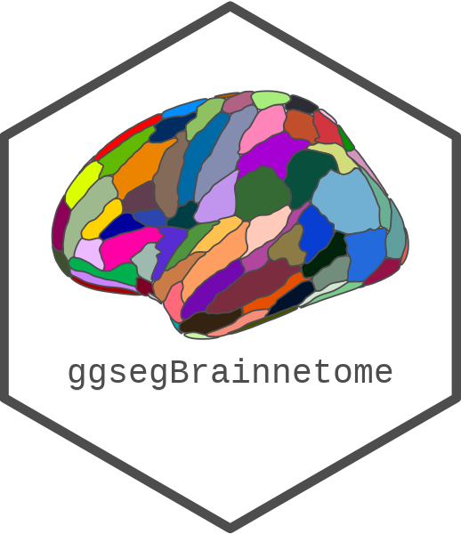

<!-- README.md is generated from README.Rmd. Please edit that file -->

```{r, include = FALSE}
knitr::opts_chunk$set(
  collapse = TRUE,
  comment = "#>",
  fig.path = "man/figures/README-",
  out.width = "100%",
  fig.width = 10, 
  fig.retina = 3
)
```

# ggsegBrainnetome 

<!-- badges: start -->
[](https://codecov.io/gh/LCBC-UiO/ggsegBrainnetome?branch=master)
[](https://github.com/LCBC-UiO/ggsegBrainnetome/actions)
[](https://zenodo.org/badge/latestdoi/250281064)
<!-- badges: end -->

This package contains dataset for plotting the Tracula white matter tracts with ggseg and ggseg3d. 

Yendiki et al. (2011) _Automated probabilistic reconstruction of white-matter pathways in health and disease using an atlas of the underlying anatomy_. Front. Neuroinform. 5:23. [doi: 10.3389/fninf.2011.00023](https://www.ncbi.nlm.nih.gov/pubmed/22016733)

## Installation

We recommend installing the ggseg-atlases through the ggseg [r-universe](https://ggseg.r-universe.dev/ui#builds):

```{r eval = FALSE}
# Enable this universe
options(repos = c(
    ggseg = 'https://ggseg.r-universe.dev',
    CRAN = 'https://cloud.r-project.org'))

# Install some packages
install.packages('ggsegBrainnetome')
```

You can install the released version of ggsegBrainnetome from [GitHub](https://github.com/) with:

``` r
# install.packages("remotes")
remotes::install_github("LCBC-UiO/ggsegBrainnetome")
```

```{r}
library(ggseg)
library(ggplot2)
library(ggseg3d)
library(ggsegBrainnetome)
library(dplyr)

plot(brainnetome) +
  theme(legend.position = "bottom", 
        legend.text = element_text(size = 9)) +
  guides(fill = guide_legend(ncol = 3))

```

```{r "noneval", eval=FALSE}
ggseg3d(atlas = brainnetome_3d) %>% 
  add_glassbrain() %>% 
  pan_camera("right lateral")
```

```{r "orca", include=FALSE}
p <- ggseg3d(atlas = brainnetome_3d) %>%
  add_glassbrain(hemisphere = "left")%>%
  pan_camera("right lateral") %>%
  plotly::add_annotations( text="Screen capture",
                  legendtitle=TRUE, showarrow=FALSE,
                  font = list(color = "#000000b4",
                              family = 'sans serif',
                              size = 50))
plotly::orca(p, "man/figures/README-3d-plot.png")
```

```{r "incl", echo=FALSE}
knitr::include_graphics("man/figures/README-3d-plot.png")
```

Please note that the 'ggsegBrainnetome' project is released with a
[Contributor Code of Conduct](CODE_OF_CONDUCT.md).
By contributing to this project, you agree to abide by its terms.
