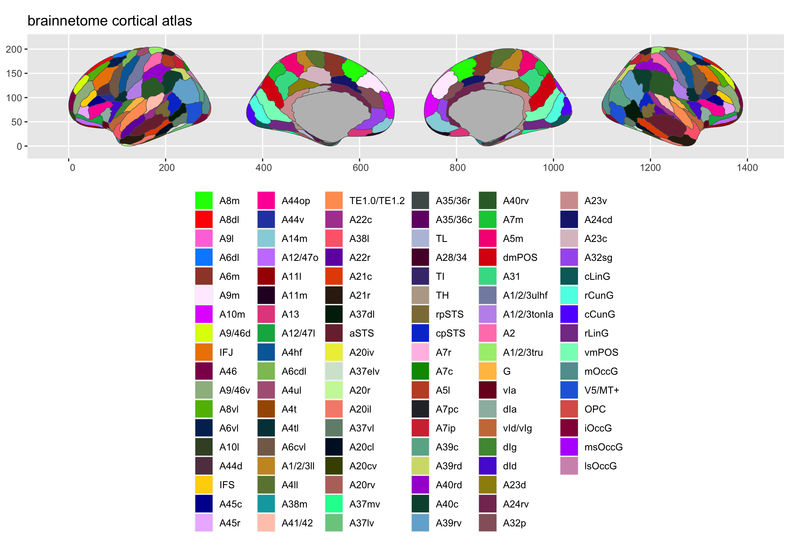
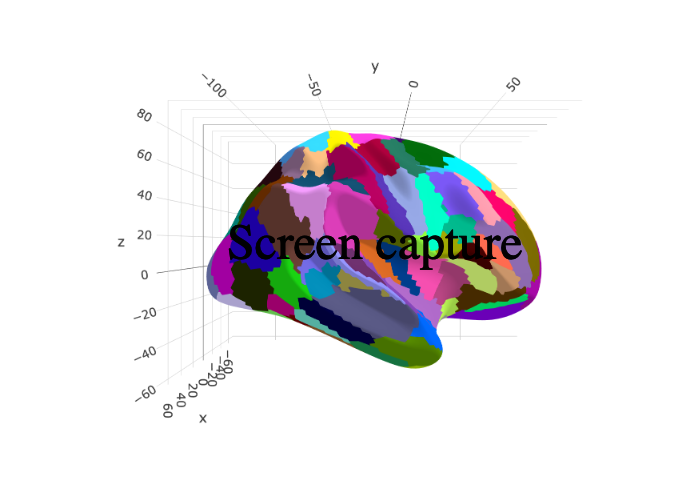

<!-- README.md is generated from README.Rmd. Please edit that file -->

# ggsegBrainnetome 

<!-- badges: start -->

[](https://github.com/ggseg/ggsegBrainnetome/actions)
[](https://zenodo.org/badge/latestdoi/416644902)
<!-- badges: end -->

This package contains dataset for plotting the
[Brainnetome](https://atlas.brainnetome.org/) atlas ggseg and ggseg3d.

Yu C, Zhou Y, Liu Y, Jiang T, Dong H, Zhang Y, Walter M. Functional
segregation of the human cingulate cortex is confirmed by functional
connectivity based neuroanatomical parcellation. Neuroimage. 2011 Feb
14;54(4):2571-81. doi: 10.1016/j.neuroimage.2010.11.018. Epub 2010 Nov
10. PMID: 21073967. [pubmed](https://pubmed.ncbi.nlm.nih.gov/21073967/).

To learn how to use these atlases, please look at the documentation for
[ggseg](https://ggseg.github.io/ggseg/) and
[ggseg3d](https://ggseg.github.io/ggseg3d)

## Installation

We recommend installing the ggseg-atlases through the ggseg
[r-universe](https://ggseg.r-universe.dev/ui#builds):

``` r
# Enable this universe
options(repos = c(
    ggseg = 'https://ggseg.r-universe.dev',
    CRAN = 'https://cloud.r-project.org'))

# Install some packages
install.packages('ggsegBrainnetome')
```

You can install the released version of ggsegBrainnetome from
[GitHub](https://github.com/) with:

``` r
# install.packages("remotes")
remotes::install_github("LCBC-UiO/ggsegBrainnetome")
```

``` r
library(ggseg)
#> Loading required package: ggplot2
library(ggseg3d)
library(ggsegBrainnetome)

plot(brainnetome) +
  theme(legend.position = "bottom", 
        legend.text = element_text(size = 9)) +
  guides(fill = guide_legend(ncol = 6))
```



``` r
library(dplyr)
ggseg3d(atlas = brainnetome_3d) %>% 
  add_glassbrain() %>% 
  pan_camera("right lateral")
```



## Citation

Athanasia Monika Mowinckel. (2021). ggseg/ggsegBrainnetome: v0.0.1
(v0.0.1). Zenodo. <https://doi.org/10.5281/zenodo.5569249>

    @software{athanasia_monika_mowinckel_2021_5569249,
      author       = {Athanasia Monika Mowinckel},
      title        = {ggseg/ggsegBrainnetome: v0.0.1},
      month        = oct,
      year         = 2021,
      publisher    = {Zenodo},
      version      = {v0.0.1},
      doi          = {10.5281/zenodo.5569249},
      url          = {https://doi.org/10.5281/zenodo.5569249}
    }

Please note that the ‘ggsegBrainnetome’ project is released with a
[Contributor Code of Conduct](CODE_OF_CONDUCT.md). By contributing to
this project, you agree to abide by its terms.
